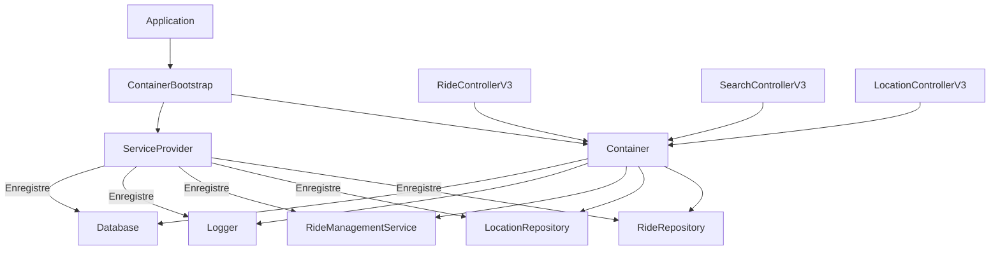

# Container d'Injection de Dépendances EcoRide

## 📋 Vue d'ensemble

Le Container d'Injection de Dépendances (DI Container) d'EcoRide est un système moderne qui automatise la gestion des dépendances entre les classes, améliore la testabilité et facilite la maintenance du code.

### 🎯 Objectifs

- **Gestion automatique** des dépendances entre services
- **Architecture modulaire** et faiblement couplée
- **Testabilité** améliorée avec mocking facilité
- **Performance** optimisée avec singletons et cache
- **Migration progressive** depuis l'architecture legacy

## 🏗️ Architecture

### Composants Principaux

```
app/Core/Container/
├── ContainerInterface.php      # Interface PSR-11 conforme
├── Container.php              # Implémentation du container
├── ServiceProvider.php        # Enregistrement des services
├── ContainerBootstrap.php     # Initialisation et helpers
└── Exceptions/
    ├── ContainerException.php  # Exception générale
    └── NotFoundException.php   # Service non trouvé
```

### Schéma d'Architecture



## 🚀 Utilisation

### 1. Initialisation de Base

```php
use App\Core\Container\ContainerBootstrap;

// Initialisation avec configuration par défaut
$container = ContainerBootstrap::bootstrap();

// Avec configuration personnalisée
$config = ContainerBootstrap::getEnvironmentConfig('development');
$container = ContainerBootstrap::bootstrap($config);
```

### 2. Récupération de Services

```php
// Récupération directe
$logger = $container->get(\App\Core\Logger::class);

// Via alias
$database = $container->get('database');

// Résolution automatique avec dépendances
$rideService = $container->get(\App\Domain\Services\RideManagementService::class);
```

### 3. Création de Contrôleurs

```php
use App\Controllers\Refactored\RideControllerV3;

// Création avec injection automatique des dépendances
$controller = ContainerBootstrap::createController(RideControllerV3::class);

// Le contrôleur a automatiquement ses dépendances injectées
$response = $controller->index();
```

### 4. Helpers Globaux

```php
// Après intégration avec l'app legacy
ContainerBootstrap::integrateWithLegacyApp($app);

// Helper container()
$service = container(\App\Core\Logger::class);
$container = container(); // Instance du container

// Helper resolve()
$controller = resolve(RideControllerV3::class);
```

## 🔧 Configuration

### Environnements

Le système supporte plusieurs environnements avec configurations optimisées :

#### Développement
```php
$config = [
    'environment' => 'development',
    'logger' => [
        'level' => 'debug',
        'path' => BASE_PATH . '/logs/dev.log'
    ],
    'cache' => [
        'ttl' => 60,
        'enabled' => true
    ]
];
```

#### Production
```php
$config = [
    'environment' => 'production',
    'logger' => [
        'level' => 'warning',
        'path' => BASE_PATH . '/logs/prod.log'
    ],
    'cache' => [
        'ttl' => 3600,
        'enabled' => true
    ]
];
```

### Services Enregistrés

#### Services Core
- **Logger** : Logging structuré avec niveaux configurables
- **Database** : Adapter pour l'accès base de données legacy
- **RepositoryFactory** : Création des repositories

#### Repositories
- **RideRepositoryInterface** : Gestion des trajets (singleton)
- **MySQLLocationRepository** : Gestion des lieux (singleton)

#### Services Métier
- **RideManagementService** : Logique business des trajets

#### Services Additionnels
- **Cache** : Cache en mémoire avec TTL
- **Notification** : Service de notification (email, SMS)
- **Profiler** : Mesure de performance (développement)
- **Debug** : Outils de debug (développement)

## 📊 Fonctionnalités Avancées

### 1. Profiling et Performance

```php
// Démarrage du profiling
$profiler = $container->get('profiler');
$profiler->start('operation_name');

// ... code à mesurer ...

$duration = $profiler->stop('operation_name');
echo "Durée: {$duration}s";
```

### 2. Cache Intelligent

```php
$cache = $container->get('cache');

// Stockage avec TTL
$cache->set('key', $value, 3600);

// Récupération
$value = $cache->get('key', 'default_value');

// Vérification d'existence
if ($cache->has('key')) {
    // ...
}
```

### 3. Notifications

```php
$notification = $container->get('notification');

// Email
$notification->sendEmail('user@example.com', 'Sujet', 'Corps du message');

// SMS
$notification->sendSMS('+33123456789', 'Message SMS');
```

### 4. Debug et Monitoring

```php
// Statistiques du container
$stats = $container->getStats();

// Rapport de performance complet
$report = ContainerBootstrap::getPerformanceReport();

// Validation de la configuration
$validation = ContainerBootstrap::validateConfiguration();
```

## 🔄 Migration Progressive

### Configuration des Routes V3

```php
// Setup de la migration
ContainerBootstrap::setupProgressiveMigration([
    '/api/v3/rides' => RideControllerV3::class,
    '/api/v3/search' => SearchControllerV3::class,
    '/api/v3/locations' => LocationControllerV3::class,
]);

// Middleware de migration
$middleware = $container->get('migration.middleware');
$controller = $middleware->handle('/api/v3/rides');

if ($controller) {
    // Utiliser le contrôleur V3
} else {
    // Utiliser le contrôleur legacy
}
```

### Stratégie de Migration

1. **Phase 1** : Déploiement du container en parallèle
2. **Phase 2** : Migration des routes critiques vers V3
3. **Phase 3** : Migration progressive des autres routes
4. **Phase 4** : Suppression des contrôleurs legacy

## 🧪 Tests et Développement

### Tests Unitaires avec Mocking

```php
use PHPUnit\Framework\TestCase;
use App\Core\Container\Container;

class RideControllerV3Test extends TestCase
{
    private Container $container;
    
    public function setUp(): void
    {
        $this->container = new Container();
        
        // Mock des dépendances
        $mockRepo = $this->createMock(RideRepositoryInterface::class);
        $this->container->instance(RideRepositoryInterface::class, $mockRepo);
        
        // ... autres mocks
    }
    
    public function testIndex(): void
    {
        $controller = $this->container->resolve(RideControllerV3::class);
        $result = $controller->index();
        
        $this->assertTrue($result['success']);
    }
}
```

### Debug en Développement

```php
if (env('APP_ENV') === 'development') {
    // Affichage des stats du container
    $debug = $container->get('debug');
    $debug->dumpContainer();
    
    // Vérification des services
    $validation = ContainerBootstrap::validateConfiguration();
    var_dump($validation);
}
```

## 📈 Performance et Optimisation

### Métriques Disponibles

```php
$report = ContainerBootstrap::getPerformanceReport();

// Statistiques
echo "Services : " . $report['container_stats']['bindings_count'];
echo "Mémoire : " . $report['performance_metrics']['memory_usage_mb'] . " MB";
echo "Ratio singletons : " . $report['performance_metrics']['singleton_ratio'];

// Recommandations automatiques
foreach ($report['recommendations'] as $rec) {
    echo "💡 " . $rec;
}
```

### Optimisations Recommandées

1. **Singletons** : Enregistrer les services coûteux comme singletons
2. **Cache** : Utiliser le cache pour les données fréquemment accessédées
3. **Lazy Loading** : Différer l'instanciation des services non critiques
4. **Monitoring** : Surveiller l'usage mémoire et les temps de réponse

## 🔐 Sécurité

### Bonnes Pratiques

1. **Validation** : Valider toutes les dépendances au bootstrap
2. **Isolation** : Séparer les services par environnement
3. **Logging** : Logger toutes les opérations sensibles
4. **Permissions** : Vérifier les autorisations avant résolution

### Exemple de Service Sécurisé

```php
$container->singleton('secure.service', function(ContainerInterface $c) {
    $logger = $c->get('logger');
    
    return new class($logger) {
        private Logger $logger;
        
        public function __construct(Logger $logger) {
            $this->logger = $logger;
        }
        
        public function sensitiveOperation(User $user): bool {
            $this->logger->info('Operation sensible', ['user_id' => $user->getId()]);
            
            if (!$user->hasPermission('admin')) {
                $this->logger->warning('Accès refusé', ['user_id' => $user->getId()]);
                return false;
            }
            
            // ... opération
            return true;
        }
    };
});
```

## 🚨 Dépannage

### Erreurs Courantes

#### Service Non Trouvé
```
Service 'X' non trouvé dans le container
```
**Solution** : Vérifier que le service est enregistré dans ServiceProvider

#### Dépendance Circulaire
```
Dépendance circulaire détectée pour le service 'X'
```
**Solution** : Utiliser une factory ou revoir l'architecture

#### Classe Non Instanciable
```
Classe 'X' n'est pas instanciable
```
**Solution** : Vérifier que la classe n'est pas abstraite ou interface

### Validation de Configuration

```php
$validation = ContainerBootstrap::validateConfiguration();

if ($validation['status'] !== 'ok') {
    foreach ($validation['errors'] as $error) {
        echo "❌ " . $error . "\n";
    }
}
```

## 📚 Exemples Pratiques

### Exemple Complet d'Utilisation

```php
// 1. Bootstrap du container
$container = ContainerBootstrap::bootstrap([
    'environment' => 'development'
]);

// 2. Validation
$validation = ContainerBootstrap::validateConfiguration();
if ($validation['status'] !== 'ok') {
    die('Configuration invalide');
}

// 3. Création d'un contrôleur
$controller = ContainerBootstrap::createController(RideControllerV3::class);

// 4. Simulation d'une requête
$_GET = ['page' => 1, 'limit' => 10];
$response = $controller->index();

// 5. Monitoring des performances
$report = ContainerBootstrap::getPerformanceReport();
echo "Performance : " . $report['performance_metrics']['memory_usage_mb'] . " MB";
```

### Exemple d'Extension

```php
// Ajout d'un service personnalisé
$container->singleton('custom.service', function(ContainerInterface $c) {
    $logger = $c->get('logger');
    $cache = $c->get('cache');
    
    return new CustomService($logger, $cache);
});

// Utilisation
$customService = $container->get('custom.service');
```

## 🎯 Conclusion

Le Container d'Injection de Dépendances d'EcoRide offre :

✅ **Architecture Moderne** - Pattern DI standard PSR-11  
✅ **Performance Optimisée** - Singletons et cache intelligents  
✅ **Testabilité** - Mocking facilité pour tests unitaires  
✅ **Migration Progressive** - Coexistence avec code legacy  
✅ **Monitoring Avancé** - Debug et profiling intégrés  
✅ **Sécurité** - Validation et logging des opérations  

Cette infrastructure solide permet à EcoRide d'évoluer vers une architecture moderne tout en maintenant la compatibilité avec l'existant.

---
*Documentation mise à jour : Container DI EcoRide v1.0* 